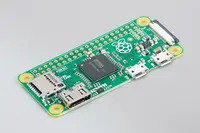
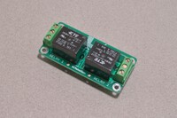
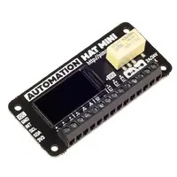
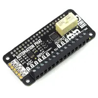
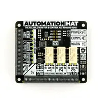
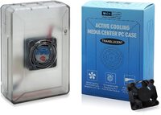

# Garage Pie

Open and close your garage door with a Raspberry Pi.

Sometimes I forget to close my garage door when I leave the house.
Sometimes I need to let someone into my house when I am not home.
This allows me to do both of those things in a low-complexity way.
Or, at least, in a way with complexity that I'm comfortable with.

**Pros**

- Low cost. Raspberry Pis are ubiquitous and low-cost. I had two lying around. The required HATs are
  cheap (or you could just solder a relay directly), cases are cheap, and wire is cheap.
- No ecosystem. The boards connect over regular Wi-Fi or ethernet and expose a simple HTTP
  interface. You can expose them to the internet however you want, or don't. You can expose them to
  automation tooling (like Home Assistant), or don't.

**Cons**

- Not turnkey. Building the hardware and setting up the software is not hard, but it is still a
  solution that involves more setup than something like an off-the-shelf device.
- No polish. Will not pass the Significant-Other Bar™ out-of-the-box.

## Hardware

You will need to obtain three main components:
- Raspberry Pi computer
- One 24V relay per door (usually from a HAT)
- Wall- or ceiling-mountable case

### Raspberry Pi Zero

The Raspberry Pi Zero is the ideal board given its price, that the software CPU/RAM requirements
are low, and that it will likely be mounted to the ceiling. Ensure you get the Zero W for a board
that includes a Wi-Fi chip (or the Zero WH).

#### Suggested Relay HATs

- 2 relays: [BC Robotics Relay HAT](https://bc-robotics.com/shop/raspberry-pi-zero-relay-hat/)
  ([Assembled](https://bc-robotics.com/shop/raspberry-pi-zero-relay-hat-assembled/))

  

- 1 relay: [Pimoroni Automation HAT mini](https://shop.pimoroni.com/products/automation-hat-mini)

  

- 1 relay: [Pimoroni Automation pHAT](https://shop.pimoroni.com/products/automation-phat) [Discontinued]

  

#### Suggested Cases

- [UniPiCase Zero (Tall)](https://www.unipicase.com/products/unipicase-zero/)

  A dedicated hole will need drilled through the case near the terminals to accommodate the garage
  door wire.

  

### Raspberry Pi 3/4

The full-size Raspberry Pi boards are more than capable (if not overkill). Generally they would
only be preferred if you already had one or if you need more than 2 relays to control more than 2
doors (without otherwise building a custom relay board).

#### Suggested Relay HATs
- 3 relays: [Pimoroni Automation HAT](https://shop.pimoroni.com/products/automation-hat)

  

#### Suggested Case
- [LoveRPI Active Cooling Media Center PC Case](https://www.loverpi.com/products/loverpi-active-cooling-media-center-pc-case)

  You will have to remove the fan, the fan mounting standoffs, and the coupling standoff to fit the
  board with a HAT. Additionally, if your HAT is secured to the Pi with a standoff and screws
  beneath the board you will have to shave down the plastic board standoffs ~1mm to accommodate the
  screw heads. The garage door wire will have to be passed through the fan slits, or a dedicated
  hole will need drilled near the terminals.

  

## Installation

TODO
- Assemble
- Mount
- Wire

## Software

TODO
- Docker
- Binary
- Deb? Deb repo?

## FAQ

### Why not OpenGarage?

- I already had a camera in the garage and do not need detection.
- I did not like how it exposed itself through the internet.
- I had two Raspberry Pi 3b boards lying around and paternity leave time.

### Why not Z-Wave?

- I did not want to stand up an ecosystem for two simple toggles.
- I had two Raspberry Pi 3b boards lying around and paternity leave time.

### Why not Sonoff?

- I found out about it at the end of building this.
- I had two Raspberry Pi 3b boards lying around and paternity leave time.

### Why not [some other product]?

- I probably didn't know it existed.
- I had two Raspberry Pi 3b boards lying around and paternity leave time.

# License

    Copyright 2021 Jake Wharton

    Licensed under the Apache License, Version 2.0 (the "License");
    you may not use this file except in compliance with the License.
    You may obtain a copy of the License at

       http://www.apache.org/licenses/LICENSE-2.0

    Unless required by applicable law or agreed to in writing, software
    distributed under the License is distributed on an "AS IS" BASIS,
    WITHOUT WARRANTIES OR CONDITIONS OF ANY KIND, either express or implied.
    See the License for the specific language governing permissions and
    limitations under the License.
