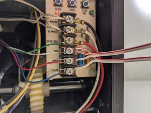
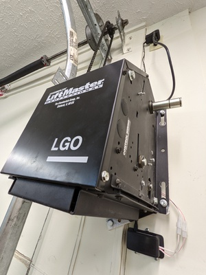
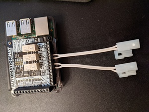

# 

Open and close your garage door (or similar) with a Raspberry Pi.

Sometimes I forget to close my garage door when I leave the house.
Sometimes I need to let someone into my house when I am not home.
This allows me to do both of those things in a low-complexity way.
Or, at least, in a way with complexity that I'm comfortable with.

**Pros**

- Low cost. Raspberry Pis are ubiquitous and low-cost. I had two lying around. The required HATs are
  cheap (or you could just solder a relay directly), cases are cheap, and wire is cheap.
- No ecosystem. The boards connect over regular Wi-Fi or ethernet and expose a simple HTTP
  interface. You can expose them to the internet however you want, or don't. You can expose them to
  automation tooling (like Home Assistant), or don't.

**Cons**

- Not turnkey. Building the hardware and setting up the software is not hard, but it is still a
  solution that involves more setup than something like an off-the-shelf device.
- No polish. Will not pass the Significant-Other Bar™ out-of-the-box.


## Quickstart

Just want to try it out? If you have Cargo installed, clone and run:
```
$ cargo run --no-default-features config.example.toml
```
And then click the link!


Press the buttons to see the changes to GPIO pins that would happen on a real Raspberry Pi.

## Hardware

You will need to obtain three main components:
- Raspberry Pi computer
- One 24V relay per button (usually from a HAT) controlled via GPIO
- Wall- or ceiling-mountable case

### Example Build #1: Pi Zero

The Raspberry Pi Zero is the ideal board given its price, that the software CPU/RAM requirements
are low, and that it will likely be mounted to the ceiling. Due to its size and HAT availability,
the Pi Zero can only control at most two single-button doors or one open/close-button door.

Ensure you get the Zero W for a board that includes a Wi-Fi chip (or the Zero WH).

[](images/p0_board.jpg)

The [BC Robotics Relay HAT](https://bc-robotics.com/shop/raspberry-pi-zero-relay-hat-assembled/)
provides two relays for controlling up to two single-button doors or one open/close-button door.

[](images/p0_hat.jpg)

The HAT attaches to the Pi via a 40-pin connector. You can use either 11mm or 12mm standoffs on
the opposite side to secure it in place.

[](images/p0_with_hat.jpg)

<details>
<summary>Looking for alternative HATs?</summary>
<blockquote>

The [Pimoroni Automation HAT mini](https://shop.pimoroni.com/products/automation-hat-mini) provides
only a single relay suitable for one single-button door.

[](images/p0_hat_mini.jpg)

The HAT attaches to the Pi via a 40-pin connector. You can use 10mm standoffs on the opposite side
to secure it in place.

</blockquote>
</details>

The [UniPiCase Zero (Tall)](https://www.unipicase.com/products/unipicase-zero/) is tall enough to
fit the HAT although it will require minor modification to work.

[](images/p0_case.jpg)

The case top features two structural pieces of plastic that must be shaved down in order to
accommodate the HAT.

[](images/p0_case_top_modified.jpg)

A dedicated opening will need drilled through the case near the terminal(s) to accommodate the
garage door wire.

[](images/p0_case_side_modified.jpg)

Attach the wire to the relays. You should use the "Common" (COM) and "Normally Open" (NO) terminals
(despite the name of the project) since triggering the button should temporarily close the circuit.

[](images/p0_with_wires_in_case.jpg)

The case does not have mounting holes. The assembly is light enough that poster-mounting squares
or other double-sided adhesive could be used. I sank two screws below and one above the case to
secure it.

[](images/p0_case_mounted.jpg)

Attach the other end of the wires to the garage door motor unit in the same terminals as the wall
buttons.

[](images/p0_wired_terminals.jpg)
[](images/p0_wired.jpg)
[](images/p0_done.jpg)


### Example Build #2: Pi 3/4

The full-size Raspberry Pi boards are more than capable (if not overkill). Generally they would
only be preferred if you already had one or if you need more than 2 relays to control more than 2
doors (without otherwise building a custom relay board).

[](images/p3b_board.jpg)

The [Pimoroni Automation HAT](https://shop.pimoroni.com/products/automation-hat) provides three
relays for controlling up to three single-button doors or one open/close-button door and one
single-button door.

[](images/p3b_hat.jpg)

The HAT attaches to the Pi via a 40-pin connector. You can use 10mm standoffs on the opposite side
to secure it in place.

[](images/p3b_with_hat.jpg)

The [LoveRPI Active Cooling Media Center PC Case](https://www.loverpi.com/products/loverpi-active-cooling-media-center-pc-case)
isn't made for HATs, but is trivially modified to fit them.

[](images/p3b_case_empty.jpg)

If your HAT is secured to the Pi with standoffs and screws, beneath the board you will have to
shave down the plastic board standoffs ~1mm to accommodate the screw heads.

[](images/p3b_case_bottom_modified.jpg)
[](images/p3b_case_bottom_with_pi.jpg)

Additionally, you will have to remove the fan, the fan mounting standoffs, and the coupling
standoff to fit the HAT.

[](images/p3b_case_top_modified.jpg)
[](images/p3b_case_top_on_pi.jpg)

The garage door wire will have to be passed through the fan slits, or a dedicated hole for each
relay will need to be shaped near the terminals.

[](images/p3b_case_side_modified.jpg)

Attach the wire to the relays. You should use the "Common" (COM) and "Normally Open" (NO) terminals
(despite the name of the project) since triggering the button should temporarily close the circuit.

[](images/p3b_with_wires.jpg)
[](images/p3b_with_wires_in_case.jpg)

Since the case already had mounting holes, sink two screws into the ceiling or wall near the
garage door motor unit and set up the Pi.

[](images/p3b_case_bottom_mounted.jpg)
[](images/p3b_case_mounted.jpg)

Attach the other end of the wires to the garage door motor unit in the same terminals as the wall
buttons.

[](images/p3b_wired.jpg)
[](images/p3b_done.jpg)


## Installation

### Docker

A container which runs the binary is available from Docker Hub and GitHub Container Registry.

* `jakewharton/normally-closed`
  [][hub]
  [][hub]

* `ghcr.io/jakewharton/normally-closed`

[hub]: https://hub.docker.com/r/jakewharton/normally-closed/

Mount the `/config` folder which contains a `config.toml` or mount a `/config/config.toml` file directly for the [configuration file](#Configuration).
The container serves the website on port 80. You can map it to your desired port using `-p`.

```
$ docker run -d \
    -v /path/to/config.toml:/config/config.toml \
    -p 8080:80 \
    jakewharton/normally-closed
```

Docker Compose is also supported:

```yaml
services:
  normally-closed:
    image: jakewharton/normally-closed
    restart: unless-stopped
    ports:
      - 8080:80
    volumes:
      - /path/to/config.toml:/config/config.toml
```


### Binary

If you have Rust installed with Cargo you can install the binary by running `cargo install normally-closed`
([](https://crates.io/crates/normally-closed)).
Otherwise a prebuilt binary is available on [the latest GitHub release](https://github.com/JakeWharton/NormallyClosed/releases/latest).

The path to your [configuration file](#Configuration) is a required argument.
The website will be served on port 31415 by default.

```
$ normally-closed --help
normally-closed 0.1.0

USAGE:
    normally-closed [OPTIONS] <config-file>

FLAGS:
    -h, --help       Prints help information
    -V, --version    Prints version information

OPTIONS:
        --http-port <port>    HTTP port [default: 31415]

ARGS:
    <config-file>    TOML configuration file. See https://github.com/JakeWharton/NormallyClosed#configuration
```

### Other

Want to maintain a Linux distro installation? Please do! PRs for distro installation welcome.


## Configuration

A TOML file defines the available relays and which doors map to which relays.

Here is a full example:
```toml
version = 0

[relays]
board = "PIM213"

[[door]]
name = "Left"
relay = 1

[[door]]
name = "Right"
relay = 2
```

### `version`

Always 0 until version 1.0.0 is released.

### `secondary_hosts`

Additional hosts whose doors will be displayed on this host.

```toml
secondary_hosts = [
  "http://example.com:1234",
]
```

Doors from each host will be updated every minute.

Note: 'https' is not supported at this time.

### `relays`

Either a named board:
```toml
[relays]
board = "PIM213"
```

| Board                 | Relay count |
|-----------------------|-------------|
| [PIM213]              | 3           |
| [PIM487]              | 1           |
| [PIM221]              | 1           |
| [RAS-109] / [RAS-194] | 2           |

[PIM213]: https://shop.pimoroni.com/products/automation-hat
[PIM221]: https://shop.pimoroni.com/products/automation-phat
[PIM487]: https://shop.pimoroni.com/products/automation-hat-mini
[RAS-109]: https://bc-robotics.com/shop/raspberry-pi-zero-relay-hat/
[RAS-194]: https://bc-robotics.com/shop/raspberry-pi-zero-relay-hat-assembled/

Or a list of GPIO pins corresponding to relays:
```toml
[relays]
pins = [11, 13, 15, 17]
```

### `door`

Either a single toggle button:
```toml
[[door]]
name = "Garage"
relay = 1
```

Or multiple discrete buttons:
```toml
[[door]]
name = "Garage"
open_relay = 1
close_relay = 2
stop_relay = 3  # OPTIONAL!
```

In either form, all doors must have names, relays use 1-based indexing, and no door may use the same relay as another.


## Usage

Visit the website in a browser.
Click the buttons!


Your URL will depend on the hostname of the Pi and the port you choose.


## Local Development

The binary targets the Raspberry Pi through the use of a Cargo feature which is enabled by default.
Disabling the default feature will allow you to run locally with GPIO pin changes printed instead.

 * Build: `cargo build --no-default-features`
 * Test: `cargo test --no-default-features`
 * Lint: `cargo clippy --no-default-features`
 * Format: `cargo +nightly fmt`
 * Run: `./target/debug/normally-closed args...`


## FAQ

### Why not OpenGarage?

- I already had a camera in the garage and do not need detection.
- I did not like how it exposed itself through the internet.
- Does not support doors with explicit open/close control buttons.
- I had two Raspberry Pi 3b boards lying around and paternity leave time.

### Why not Z-Wave / Zigbee?

- I did not want to stand up an ecosystem for two simple toggles.
- I had two Raspberry Pi 3b boards lying around and paternity leave time.

### Why not [some other product]?

- I probably didn't know it existed.
- I had two Raspberry Pi 3b boards lying around and paternity leave time.

### Why?

I had two Raspberry Pi 3b boards lying around and paternity leave time.

### How do I access this outside of my home network?

This is your problem!

I personally use WireGuard to jump into my home network and connect directly to each Pi.


# License

    Copyright 2021 Jake Wharton

    Licensed under the Apache License, Version 2.0 (the "License");
    you may not use this file except in compliance with the License.
    You may obtain a copy of the License at

       http://www.apache.org/licenses/LICENSE-2.0

    Unless required by applicable law or agreed to in writing, software
    distributed under the License is distributed on an "AS IS" BASIS,
    WITHOUT WARRANTIES OR CONDITIONS OF ANY KIND, either express or implied.
    See the License for the specific language governing permissions and
    limitations under the License.
